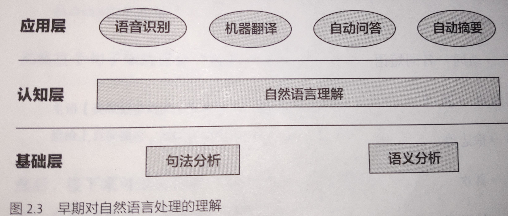
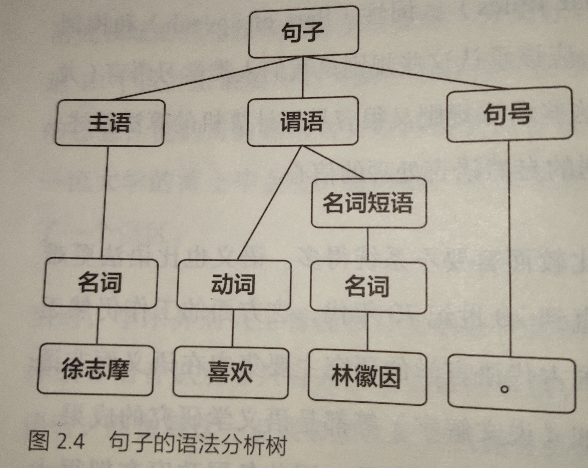

#	数学之美读书笔记
	作者：顾轩
	日期：2020.1.19

##	第1章	文字和语言 VS 数字和信息

- 文字和语言与数学，从产生起原本就具有相通性，虽然它们的发展一度分道扬镳，但是最终还是能走到一起。
- 数字、文字和自然语言一样，都是信息的载体。

###	1、信息
- 开始时我们的祖先采用声音来传播信息。比如可能会用特定的声音，如“呀呀呀”表示“那里有一只熊”。
- 早期信息很少，不需要语言和数字，但是随着人类进步和文明的发展，所表达信息越来越多，不再是几种声音可以表达，因此语言产生。
- 原始人通信方式和今天的通信模型没有什么不同。
  

###	2、文字和数字
- 开始利用声音传递信息，，后来信息变多，产生了语言，，当语言复杂和繁多到一定程度，人类无法记住所有词汇，便需要文字进行高效记录，由此文字产生。
- 作者举了一些文字记录历史的例子，比如罗塞塔石碑的破译，对从事自然语言处理的学者来说有如下两个意义：
	-	信息的的冗余是信息安全的保障，对信道编码有指导意义，信道编码就是提高信息的冗余度，从而提高信息传输的可靠性，不容易出错。
	-	语言的数据，我们称之为语料，尤其是双语或者多语的对照语料对翻译至关重要，他是我们从事机器翻译研究的基础。采用计算机和数学工具，可以在短时间内实现目的。
	
- 数字出现在人们的财产多到需要数一数才能搞清楚有多少的时候，早期数字并没有书写的形式，而是掰指头，这便是现在采用十进制的原因。
- 位进制的发明（我们常说的逢十进一）表明祖先开始懂得对数量进行编码。
- 玛雅文明采用的是二十进制，算上了脚趾头。
- 数字中的解码：在中国，采用规则为乘法；而在罗马，采用的规则是加减法，小数字出现在大数字左边为减，右边为加。
- 阿拉伯数字是描述数字更加有效的方式，但其实它们是由印度人发明的。标志着数字和文字的分离。
###	3、文字和语言背后的数学
- 信息的编码：象形文字到拼音文字是一个飞跃，由物体的外表到抽象，采用了对信息的编码且编码合理，常用字笔画少，生僻字笔画多。
- 信息压缩和解压缩：古代文言文非常简洁难懂但相同时期口语却和现在相差不大。与现在信息的传送很相似，信息在传递前需尽可能地压缩，然后再接受端解压缩。两个人讲话说的快是一个宽信道，无需压缩；书写来得慢是一个窄信道，需要压缩和解压缩。
- 信息校验：《圣经》的创作经过几个世纪，为了避免出错，在每一行进行一个校验码，这与我们现代通信系统中差错分析中的校验极为相似。
- 语法：语法是语言的编码和解码规则，任何语言都有语法覆盖不到的地方。设计到一个语言学研究方向的问题：语言对还是语法对。语言坚持从真实的语句文本出发，后者坚持从规则出发。最终证明，自然语言处理采用从语料出发，即基于统计规则。

##	第2章	自然语言处理——从统计到规则
人类对机器理解自然语言的认识走了一条大弯路。早期的研究中采用了基于规则的方法，虽然解决了简单的问题，但是无法从根本上将自然语言理解实用化。20多年后，采用基于统计规则的方法进行自然语言处理，才有突破性的进展和实用的产品。
###	1、机器智能
最早提出机器智能设想是计算机科学家图灵——图灵测试。
达特茅斯夏季人工智能研究会议——（讨论当时未解决的问题：人工智能、自然语言处理、神经网络）

实现人工智能的第一步让计算机理解自然语言，这样才能让机器完成翻译或者语音识别等只有人类才能完成的事情，当时想法是让机器拥有向人类的智能，但这几乎是不可能的。如何让计算机理解自然语言：

分析语法和获取语义

早期的思路是分析语法和获取语义，但是语言这个东西，一句话可能有各种理解和各种表述，所以不是一个很好的方法，所取得效果也不是很好，后来就变成基于统计规则的自然语言处理了。

当时语义分析和句法分析采用的是分析树的形式，以“徐志摩喜欢林徽因”为例：

下面是早期对自然语言处理的理解：

  

例句的语法分析树：

  

###	2、从规则到统计
1970年以后统计语言学的出现是自然语言处理获得新生，关键人物弗里德里克.贾利尼克和他领导的IBM华生实验室。采用基于统计的方法，IBM将语音识别率从70%提高到90%，规模从几百单词上升到几万单词。

现在自然语言处理从原来单纯的句法分析和语义理解变成了非常贴近生活的机器翻译、语音识别、文本到数据库自动生成、数据挖掘和知识的获取。

基于统计的自然语言处理，在数学模型上和通信是相通的，甚至是相同的，数学意义上自然语言处理和语言的初衷——通信联系到一起了。但是，科学家们用了几十年才认识到这个联系.

##	第3章	统计语言模型
##	第4章	谈谈分词
##	第5章	隐马尔可夫模型
##	第6章	信息的度量和作用
##	第7章	贾里尼克和现代语言处理
##	第8章	

##	第8章	简单之美——布尔代数和搜索引擎
布尔代数虽然十分简单，确实计算机科学的基础，它不仅把逻辑和数学合二为一，而且给了我们一个全新的角度看待世界，**开创了数字化时代**。

###	1、布尔代数

由于人类有十根手指，所以一般采用的都是十进制，但是往往二进制是最简单的，因为其只有0和1两个数字，当然二进制也是数字化的基础。

二进制发展历史（可以用来装逼，实际用处其实不大）：

- 中国古代的阴阳学说可认为是二进制的最早雏形
- 公元前2-5世纪时印度学者将二进制作为一个技术系统，但是当时没有使用0和1计数。
- 莱布尼兹完善二进制并使用0和1技术
- 布尔是19世纪英国一位中学教师，提出了布尔运算，运用数学的方法解决逻辑问题，成为数字电路的基础，可以实现逻辑或，逻辑与、取反运算。进而推导出加减乘除、乘方开方等等。借此人们搭建了第一台电子计算机。

二进制不仅是一种计数方式，同时他也能表示逻辑的是与非，由此其可以作为判断，而搜索引擎重点之处在于判断一个网页与关键词的相关性，若能搜索到，则采用是标记，否则为否，由此可见，每个搜索引擎都无法跳出布尔运算的框架。

布尔代数对于数学的意义等同于量子力学对于物理的意义，他们将我们对世界的认识从连续状态扩展到离散状态，布尔世界里，万物都是可以量化的。

###	2、索引

##第9章	图论和网络爬虫
##	第10章	PageRank——Google的民主表决式排名技术
##	第11章	如何确定网页和查询的相关性
##	第12章	有限状态机和动态规划——地图与本地搜索的核心技术
##	第13章	Google	AK-47的设计者——阿米特.辛格博士

这一章吴军博士主要是分享一些故事，介绍介绍辛格博士顺便装个逼。

一个好的算法就应该像AK-47那样：简单、有效、可靠性强、容易读懂。

坚持选择简单方案的一个优点在于容易解释每一个步骤和方法背后的道理，不仅便于出了问题时查错，而且容易找到今后改变的目标。（因此对方案的完全理解十分重要）。辛格博士要求对搜索质量的改进方法都能说清理由，这和微软、雅虎把搜索质量的提升当作一个黑盒子完全不同，因此谷歌能保证搜索质量长期稳步提高。后面也提倡通过机器学习改进搜索质量，但要对参数和公式给予合理的解释。

年轻人不要害怕失败，大胆尝试。学习辛格博士坚持每天分析一些搜索结果不好的例子，提醒我们要尽量经常看看自己做得不好的地方。

##	第14章	余弦定理和新闻的分类

2002年，谷歌推出新闻服务，新闻由计算机整理、分类并自动生成的。关键技术在于新闻的自动分类，其用到的技术时数学中常见的余弦定理。

###新闻的特征向量

计算机的本质是做快速计算，因此需要考虑将新闻变成一组可计算的数字，然后设计算法算出任意两篇新闻的相似性。

新闻的信息和词的语义是联系在一起的，同一类新闻的关键用词都是相似的，不同新闻一般不同。在词语中不同词表达的语义重要程度不同，而且一般情况下：

- 含义丰富的实词比“的，地”这样的助词重要，也比“之乎者也”这样的虚词重要

接下来考虑如何对每个实词的重要性进行度量，在网页和查询相关性一章中可以了解到一篇文章中重要的词TF-IDF值就高。于是有与新闻主题有关的实词频率高时IF-IDF值就大，由此可得出一组描述新闻主题的数字：

对新闻中的所有实词，计算出他们的IF-IDF值。将这些值按照对应实词在词汇表中的位置依次排序，便可得到一个向量，如下所示：

 | 单词编号 | 汉字词 |IF-IDF值|
 | ------- | ------ | ------ |
 | 1 | 啊 | 0 |
 | 2 | 啊 |0.0034 |
 |...|...|...|
 |64000|做作|0.075|

如果是64000个数，便得到一个64000维的向量,便可以用这个向量代表这篇新闻，称为新闻的特征向量。向量中每一个维度的大小代表每个词对这篇新闻主题
的贡献。由此一篇新闻变成了一个个数字向量，接着便可以算一算新闻之间的相似性。

###向量距离的度量

上面实现了将新闻转化为数字，同一类新闻一定是某些主题词用得较多，另外一些词用的较少。由此看来，若两篇新闻属于同一类，他们的特征向量在某几个维度的值都比较大，其他维度的值较小。两篇新闻主题是否接近，取决于特征向量是否长得像，因此需要定量衡量特征向量的相似性。

向量实际是多维空间中从原点出发的有向线段（二维坐标系中点可用二维向量描述）。可以通过计算两个向量的夹角来判断新闻地接近程度，由此向量的夹角可以考虑三角形地余弦定理，利用余弦定理求取夹角：

$$ cosA = \frac{b^2+c^2-a^2}{2bc}$$
如果将三角形地两边$b$和$c$看作是两个以$A$为起点的向量，则上述公式等价于：
$$cosA = \frac{<b,c>}{|b|\cdot|c|}$$
其中，分母表示向量$b$和$c$的长度，分子表示两个向量的内积，举个例子：
假设新闻X和新闻Y对应向量如下：
$$x_1,x_2,...,x_{6400}和y_1,y_2,...,y_{6400}$$
则可以得到他们夹角的余弦：
$$ cos\theta = \frac{x_1y_1+x_2y_2+...+x_{6400}y_{6400}}{{\sqrt{x_1^2+x_2^2+...x_{6400}^2}}\cdot{\sqrt{y_1^2+y_2^2+...y_{6400}^2}}}$$
夹角的余弦越接近1，两则新闻越相似，从而可以归为一类；夹角地余弦越小，夹角愈大，两条新闻越不相关。

现在可以将新闻变成数字（特征向量），也有了计算相似性的公式。可以讨论新闻分类的算法，两种情况：
1. 各类新闻特征向量$x_1,x_2,...x_k$已知
2. 新闻类别特征向量未知

对于情况一：
相对简单，求出要分类新闻$Y$的特征向量，求出他和各类新闻特征向量的余弦相似值，由此可以进行分类。

情况二：
较为复杂，采用自底向上不断合并的方法，大致思路如下：
1. 计算所有新闻之间两两余弦相关性，把相似性大于一个阈值的新闻合并为一个小类。这样$N$篇新闻可以合并成$N_1$个小类，$N_1<N$
2. 每个小类中的新闻作为一个整体，计算小类的特征向量，计算小类之间的相似性，然后合并成大一点的小类，结果$N_2<N_1$

这样不断做下去，直到每个类越来越大。某一类太大时其新闻之间相似性就很小，便可以停止迭代过程了。

当时做这个分类的东西是因为一个人不想分论文，便通过这个东西可以将论文分出来。
### 计算余弦的技巧
大数据时利用上述方法的计算量是很大的，尤其是考虑到不断迭代，其计算量
无法接受，在大数据是考虑降低余弦计算的复杂度（可优化部分如下）：
1. 分母部分（向量的长度）不需要重复计算，可将各向量的长度存起来，计算量可以节省2/3
2. 分子上两个向量内积时，只需考虑非零元素，计算的复杂度取决于两向量中的最小值。而向量中的非零元素是很少的，可以根本上降低复杂度。
3. 删除虚词，不仅对提高计算速度有好处，对新闻分类的准确性也有好处，这里虚词实际上相当于噪音，与通信时过滤掉低频噪音是相同道理。

位置得加权也同样重要，出现在文本中不同位置的词的重要性不同，这和老师强调开头结尾、标题、每段第一句是类似的，因此实际中因将相应位置的相对提高一些，对标题和重要位置的词进行额外加权，可提高分类准确性。

本章介绍新闻归类的方法，准确性好，适用于分类文本集合在百万数量级，达到亿级时，计算时间太长。对于大规模文本处理，需要采用下一章的方法。
##	第15章	矩阵运算和文本处理中的两个分类问题
##	第16章	信息指纹极其应用
##	第17章	由电视剧《暗算》所想到的——谈谈密码学的数学原理
##	第18章	闪光的不一定是金子——谈谈搜索引擎反作弊问题和搜索结果的权威性问题
##	第19章	谈谈数学模型的重要性
##	第20章	不要把鸡蛋放到一个篮子里——谈谈最大熵问题
##	第21章	拼音输入法的数学模型
##	第22章	自然语言处理的教父马库斯和他的优秀弟子们
##	第23章	布隆过滤器
##	第24章	马尔科夫链的扩展——贝叶斯网络
##	第25章	条件随机场、文法分析及其他
##	第26章	维特比和他的维特比算法
##	第27章	上帝的算法——期望最大化算法
##	第28章	逻辑回归和搜索广告
##	第29章	各个击破算法和Google云计算的基础
##	第30章	Google大脑和人工神经网络
##	第31章	大数据的威力——谈谈数据的重要性