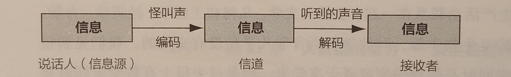
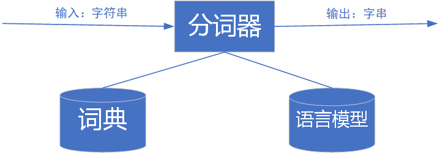
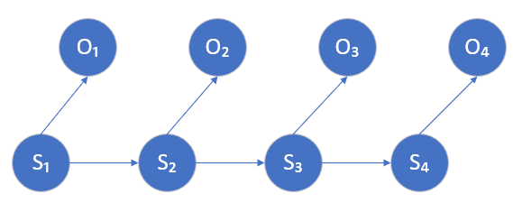
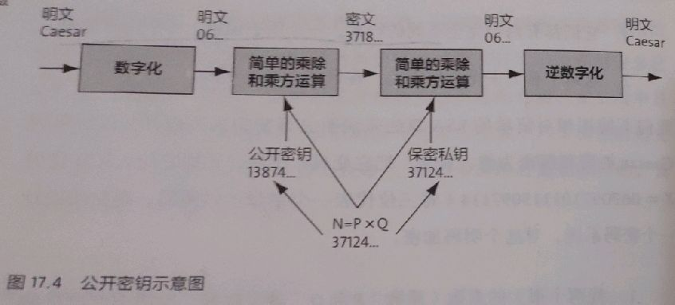

#	数学之美读书笔记
	作者：顾轩
	日期：2020.1.19
[toc]
##	第1章	文字和语言 VS 数字和信息

- 文字和语言与数学，从产生起原本就具有相通性，虽然它们的发展一度分道扬镳，但是最终还是能走到一起。
- 数字、文字和自然语言一样，都是信息的载体。

###	1、信息
- 开始时我们的祖先采用声音来传播信息。比如可能会用特定的声音，如“呀呀呀”表示“那里有一只熊”。
- 早期信息很少，不需要语言和数字，但是随着人类进步和文明的发展，所表达信息越来越多，不再是几种声音可以表达，因此语言产生。
- 原始人通信方式和今天的通信模型没有什么不同。
  

###	2、文字和数字
- 开始利用声音传递信息，，后来信息变多，产生了语言，，当语言复杂和繁多到一定程度，人类无法记住所有词汇，便需要文字进行高效记录，由此文字产生。
- 作者举了一些文字记录历史的例子，比如罗塞塔石碑的破译，对从事自然语言处理的学者来说有如下两个意义：
	-	信息的的冗余是信息安全的保障，对信道编码有指导意义，信道编码就是提高信息的冗余度，从而提高信息传输的可靠性，不容易出错。
	-	语言的数据，我们称之为语料，尤其是双语或者多语的对照语料对翻译至关重要，他是我们从事机器翻译研究的基础。采用计算机和数学工具，可以在短时间内实现目的。
	
- 数字出现在人们的财产多到需要数一数才能搞清楚有多少的时候，早期数字并没有书写的形式，而是掰指头，这便是现在采用十进制的原因。
- 位进制的发明（我们常说的逢十进一）表明祖先开始懂得对数量进行编码。
- 玛雅文明采用的是二十进制，算上了脚趾头。
- 数字中的解码：在中国，采用规则为乘法；而在罗马，采用的规则是加减法，小数字出现在大数字左边为减，右边为加。
- 阿拉伯数字是描述数字更加有效的方式，但其实它们是由印度人发明的。标志着数字和文字的分离。
###	3、文字和语言背后的数学
- 信息的编码：象形文字到拼音文字是一个飞跃，由物体的外表到抽象，采用了对信息的编码且编码合理，常用字笔画少，生僻字笔画多。
- 信息压缩和解压缩：古代文言文非常简洁难懂但相同时期口语却和现在相差不大。与现在信息的传送很相似，信息在传递前需尽可能地压缩，然后再接受端解压缩。两个人讲话说的快是一个宽信道，无需压缩；书写来得慢是一个窄信道，需要压缩和解压缩。
- 信息校验：《圣经》的创作经过几个世纪，为了避免出错，在每一行进行一个校验码，这与我们现代通信系统中差错分析中的校验极为相似。
- 语法：语法是语言的编码和解码规则，任何语言都有语法覆盖不到的地方。设计到一个语言学研究方向的问题：语言对还是语法对。语言坚持从真实的语句文本出发，后者坚持从规则出发。最终证明，自然语言处理采用从语料出发，即基于统计规则。

##	第2章	自然语言处理——从统计到规则
人类对机器理解自然语言的认识走了一条大弯路。早期的研究中采用了基于规则的方法，虽然解决了简单的问题，但是无法从根本上将自然语言理解实用化。20多年后，采用基于统计规则的方法进行自然语言处理，才有突破性的进展和实用的产品。
###	1、机器智能
最早提出机器智能设想是计算机科学家图灵——图灵测试。
达特茅斯夏季人工智能研究会议——（讨论当时未解决的问题：人工智能、自然语言处理、神经网络）

实现人工智能的第一步让计算机理解自然语言，这样才能让机器完成翻译或者语音识别等只有人类才能完成的事情，当时想法是让机器拥有向人类的智能，但这几乎是不可能的。如何让计算机理解自然语言：

分析语法和获取语义

早期的思路是分析语法和获取语义，但是语言这个东西，一句话可能有各种理解和各种表述，所以不是一个很好的方法，所取得效果也不是很好，后来就变成基于统计规则的自然语言处理了。

当时语义分析和句法分析采用的是分析树的形式，以“徐志摩喜欢林徽因”为例：

下面是早期对自然语言处理的理解：

  

例句的语法分析树：

###	2、从规则到统计
1970年以后统计语言学的出现是自然语言处理获得新生，关键人物弗里德里克.贾利尼克和他领导的IBM华生实验室。采用基于统计的方法，IBM将语音识别率从70%提高到90%，规模从几百单词上升到几万单词。

现在自然语言处理从原来单纯的句法分析和语义理解变成了非常贴近生活的机器翻译、语音识别、文本到数据库自动生成、数据挖掘和知识的获取。

基于统计的自然语言处理，在数学模型上和通信是相通的，甚至是相同的，数学意义上自然语言处理和语言的初衷——通信联系到一起了。但是，科学家们用了几十年才认识到这个联系.

##	第3章	统计语言模型
统计语言模型是自然语言处理的基础，并且被广泛应用于机器翻译、语音识别、印刷体或手写体识别、拼音纠错、汉字输入和文献查询。
### 用数学方法描述语言规律

一个句子是否合理主要看其可能性大小如何。
假设S是一个有意义的句子，现在来看她的概率：
$$ P(S) = P(w_1,w_2,w_3,...,w_n)$$

 $P(w_1,w_2,w_3,...,w_n)$可转化为：
 $$  P(w_1,w_2,w_3,...,w_n) = P(w_1) \cdot P(w_2|w_1) \cdot P(w_3|w_1,w_2) \cdot\cdot\cdot P(w_n|w_1,w_2,...,w_{n-1})$$

根据马尔可夫假设：任意一个词$w_i$出现的概率只与$w_{i-1}$有关。
 $$  P(S) = P(w_1) \cdot P(w_2|w_1) \cdot P(w_3|w_2) \cdot\cdot\cdot P(w_n|w_{n-1})$$

 上式代表二元模型，一个词的概率由其前面$N-1$个词决定，则成为$N$元模型。

现在只需要求$ P(w_i|w_{i-1})$,由概率论知识可得：
$$  P(w_i|w_{i-1}) = \frac{P(w_{i-1},w_i)}{P(w_{i-1})}$$

右边的概率很好求。假设知道语料有多大，只需要在语料中寻找 #$(w_{i-1},w_i)$ 和# $(w_i)$出现的次数，得到相对频度后：
$$   P(w_i|w_{i-1})\approx \frac{\#(w_{i-1},w_i)}{\#(w_{i-1})}$$

 如果上式中的$(w_{i-1},w_i)$在语料库中没有出现或者只出现一两次，估算概率很难，其相关解决办法再延伸阅读中介绍。
### 延伸阅读：统计语言模型的工程诀窍
#### 高阶语言模型
前面假设某处的概率只和之前一词有关，有时这过于简单

假定与前面$N-1$个词都有关系,那么$w_i$的概率只取决于之前$N-1$个词。这样的假设称为$N-1$阶马尔科夫假设。对应语言模型为$N元模型$。实际中较常见的是$N = 3$的三元模型。

#### 模型的训练：零概率问题和平滑方法

上述式子成立的前提是大数定律，因此为了减少误差，需要增加数据量，但即使数据量很大也可能出现零概率或者统计量不足的情况。可以想象在很大的数据量下基本上大部分的概率为0.这种模型称为不平滑，所以需要进行平滑处理。

古德——图灵设计的原理：没看见的事件不可认为概率为0，需从概率的总量分配一个很小的比例给没有看到的事件。因此需要将所有看得见的事件概率调小一点(统计中相信可靠的数据，对不可靠的数据应该打折扣)。

假设：在语料库中出现$r$次的词有$N_r$个，特别的，未出现的词数量为$N_0$，语料库的大小为$N$.则:
$$ N = \sum ^ \infty _{r=1} rN_r$$

出现r次的词在整个语料库中的相对频度为$rN_r/N$，不优化则用此值处理，优化可用一个比r小一点的值$d_r$进行处理。古德——图灵估计如下：
$$ d_r = (r+1) \cdot N_{r+1} /N_r$$

此时相当于将出现的词的频率降低，分配给没出现的词。在实际中，出现次数高于一定阈值的词不进行频率下调处理，只对频率较低的词进行处理。这样便完成了零概率处理和平滑处理。

同样道理，二元模型也可以进行相似的处理，即出现次数高于一定阈值的词不进行频率下调处理，将频率给未出现的词。二元模型概率公式如下：
$$P(w_i|w_{i-1})= \begin{cases}
f(w_i|w_{i-1}) & if \#(w_{i-1},w_i) \geq T\\
f_{gt}(w_i|w_{i-1}) & if  0< \#(w_{i-1},w_i) < T \\
Q(w_{i-1})\cdot f(w_i) & otherwise
\end{cases}$$

其中T是阈值，一般为8~10，$f_{gt}()$为经过古德——图灵估计后的相对频度。Q如下：
$$ Q(w_{i-1}) = \frac{1-\displaystyle\sum_{w_i seen}P(w_i|w_{i-1})}{\displaystyle\sum_{w_i seen}f(w_i)}$$

上式为卡茨退避法，同理三元模型和N元模型也有相应的表达式。一般只取三元模型，所以这里只列举三元模型概率公式：

$$P(w_i|w_{i-2},w_{i-1})= \begin{cases}
f(w_i|w_{i-2},w_{i-1}) & if \#(w_{i-2},w_{i-1},w_i) \geq T\\
f_{gt}(w_i|w_{i-2},w_{i-1}) & if  0< \#(w_{i-2},w_{i-1},w_i) < T \\
Q(w_{i-2},w_{i-1})\cdot f(w_i,w_{i-1}) & otherwise
\end{cases}$$

书中还介绍了一个线性插值法，但结果比卡茨退避法较差：
$$ P(w_i|w_{i-1}) = \lambda(w_{i-2},w_{i-1})\cdot f(w_i|w_{i-2},w_{i-1}) + \lambda (w_{i-1})\cdot f(w_i|w_{i-1}) + \lambda f(w_i)$$
#### 语料的选取问题
语料的选取也相当重要，如某个网页应用是网页搜索，则该模型的训练数据应该是杂乱的网页数据和用户输入的搜索串。

训练数据一般来说越多越好，大数据时概率模型的参数可以估计的很准确。

再训练数据和应用数据一致并且训练量足够大的情况下，训练语料的噪音高低对效果也会产生影响。训练之前应该对训练数据进行预处理，一般称为去噪。

##	第4章	谈谈分词
中文分词是中文信息处理的基础，它同样走过一段弯路，目前依靠统计语言模型已经基本解决了问题。

### 中文分词方法的演变
利用统计语言模型进行自然语言处理是建立在词的基础之上，西方拼音语言词之间有明显分界符，但中文等词之间无明显分界符，先对句子进行分词才能进行语言处理。

最简单的处理方法是查字典，将句子从左到右扫描，遇到字典中的词就标识出来，遇到复合词就找·最长的词进行匹配。后来该方法发展为最少词数的分词理论，但是该方法对有二义性的词进行分割时便无能为力，如：

		发展中国家：正确分割是：发展-中-国家，但是查字典便会分成：发展-中国-家
		上海大学城书店：正确分割:上海-大学城-书店，查字典便会分成：上海大学-城-书店。

二义性一直是一个较难解决的问题，后来该问题由郭进博士利用统计语言模型解决了二义性问题，具体方法如下：

假设一个句子$S$有几种分词方法，假设有以下三种：
$$A_1,A_2,A_3,...,A_k$$$$B_1,B_2,B_3,...,B_m$$$$C_1,C_2,C_3,...,C_n$$

其中A、B、C都是汉语的词，则最好的一种分词方法应该保证分完词后该句子出现的概率最大，即：若$A_1,A_2,A_3,...,A_k$是最好的效果，有概率满足：

$$P(A_1,A_2,A_3,...,A_k) > P(B_1,B_2,B_3,...,B_m)$$ $$P(A_1,A_2,A_3,...,A_k) > P(C_1,C_2,C_3,...,C_n)$$

所以利用上一章的统计语言模型计算每种分词后句子出现的概率，并找出其中概率最大便能找到分词结果。

但是如果采用穷举法，计算量较大。可以看成是一个动态规划问题，利用维特比算法快速找到最佳分词，模型如下：

应用不同，汉语分词的颗粒度大小不同，在机器翻译中，颗粒度应该大一些，应将“北京大学”当作一个整体，而在语音识别中应该分为"北京"和“大学”两个词。不同的应用应该有不同的分词系统。

分词技术并不只是针对亚洲语言，也可以应用到英语中，主要是手写体识别时单词之间的空格不清晰，中文分词方法可以帮助判别单词的边界。

### 延伸阅读：如何衡量分词的结果

#### 分词的一致性
衡量分词结果的好与坏，需要对计算机结果与人工分词的结果进行比较。但是不同的人对同一个句子可能有不同的分词方法，而且几乎都有道理。

统计语言模型用于分词之前，分词的准确率较低，可提升空间较大，人切分的差异影响较小，可以根据分词结果与人工切分的比较进行衡量。

但是当应用统计语言模型时，分词准确率提高，不同分词器产生的结果的差异要远远小于不同人之间看法的差异。这时简单依靠与人工分词的结果比较来衡量分词器的准确性就很难。但是幸运的是一般现在采用统计语言模型效果都差不到哪里去。

#### 词的颗粒度和层次
人工分词产生不一致的原因主要在于人们对词的颗粒度认可问题。

不同应用中会有一种颗粒度比另一种更好的情况。机器翻译中颗粒度大的效果好。网页搜索中相对而言颗粒度小的效果好。

较好的做法是让一个分词器支持不同层次的词的切分。有不同的应用自行决定切分的颗粒度。原理和实现介绍如下：
- 需要一个基本词表和一个复合词表。基本词表包括像“清华”这样不可再分的词。复合词表包含复合词以及他们有哪些基本词构成。
- 需要根据基本词表和复合词表各建立一个语言模型，如$L1$和$L2$.
- 根据基本词表和语言模型L1对句子进行分词，得到小颗粒的分词结果，基本词比较稳定，小颗粒度的分词基本不需要额外的研究。
- 在上述基础上利用复合词表和语言模型L2进行第二次分词。输入基本词串，输出复合词串，数据库改变了但是分词器本身前后完全相同。
  
分词性的准确性问题，不一致性可以分为错误和颗粒度不一致两种。错误包含越界型错误和覆盖性错误。人工分词的不一致性多属于颗粒度不一致。

对于某些应用须尽可能找到各种复合词，需要继续进行数据挖掘，不断完善复合词的词典，也是近几年中文分词工作的重点。

##	第5章	隐马尔可夫模型
隐马尔科夫模型最初应用于通信领域，进而推广到语音和语言处理中，成为连接自然语言处理的通信的桥梁。同时隐马尔科夫模型也是机器学习主要工具之一。
### 	通信模型
通信的本质是一个编解码和传输的过程。早期自然语言处理主要集中在语法语义和知识表述上，与通信相差甚远。后来将自然语言处理的问题回归到通信系统中的解码问题（即由收到的信号推测别人发送的信号），相关难题迎刃而解。

一个典型的通信系统：发送者、编码、信道、解码、接收者。

这里我们关注的是如何根据接收到的信息来推测出发送的信号。通信模型和自然语言处理模型有相通之处。语音识别是根据收到的语音猜测说话者表达的意思，机器翻译和自动纠错也可以近似理解。都是根据接收信息来推测出发送的信息。由此几乎所有自然语言处理问题都可以等加成通信中的解码问题。

现在要求出所有信息源中最可能产生观测信号的那一组信息。即求出使条件概率$P(S_1,S_2,S_3,...|O_1,O_2,O_3,...)$达到最大值的那串信息：$S_1,S_2,S_3,...$即：

$$
 S_1,S_2,S_3,... = \underset{all \, S_1,S_2,S_3,\ldots}{\operatorname{Arg\,Max}}\, P(S_1,S_2,S_3,...|O_1,O_2,O_3,...).   
$$

上述概不好算，转化为如下公式：
$$ \frac{P(O_1,O_2,O_3,...|S_1,S_2,S_3,...)\cdot P(S_1,S_2,S_3,...)}{P(O_1,O_2,O_3,...)}$$

在上式中，一旦接受端接收信号。则$P(O_1,O_2,O_3,...)$概率成为一个定值，可以忽略常数。由此可以得到上式公式等价为：
$$P(O_1,O_2,O_3,...|S_1,S_2,S_3,...)\cdot P(S_1,S_2,S_3,...) $$

这个公式便可以根据隐马尔可夫模型来估计。上式个部分意义较为明显，不再赘述。

### 隐马尔科夫模型

随机过程和随机变量的区别(举个例子)：
随机变量就是一个事件有不同的可能性，随机过程表示任何一个状态t，对应的$S_t$都是随机的。随机过程相当于在随机变量上加一个时间维度，不同时间产生结果也不同。

$S_1,S_2,S_3,...S_t...$看成北京每天的最高气温，这里面每一个状态$S_t$都是随机的。每一天的最高气温与这段时间以前的最高气温是相关的，随机过程有两个维度的不确定性。

马尔科夫假设类似于某一天的最高气温只与前一天的最高气温有关，即：$P(s_t|s_1,s_2,s_3,...,s_{t-1}) = P(s_t|s_{t-1})$.符合此假设的随机过程称为马尔可夫过程，也称马尔科夫链。

隐含马尔可夫模型是马尔可夫链的一个扩展：任一时刻的状态$S_t$是不可见的。无法通过观察$S_1.S_2,S_3,...S_T$来推测转移概率等参数。但每个时刻隐含马尔可夫模型会输出一个符号$O_t$，且$O_t$仅和$S_t$相关，称为独立输出假设。其相应的模型如下：

可以计算某个特定序列$S_1,S_2,S_3,...S_t...$产生输出符号$P(O_1,O_2,O_3,...)$的概率：

$$P(S_1,S_2,S_3,...O_1,O_2,O_3,...) = \prod_{t} P(S_t|S_{t-1})\cdot P(O_t|S_t)$$

前面通信模型中所得的最后一个式子便是上式。由此可以利用隐马尔科夫模型解决自然语言处理问题。再利用维特比算法便可以找出要识别的句子$S_1,S_2,S_3,...S_t...$

#### 延伸阅读：隐含马尔可夫模型的训练
隐含马尔可夫有三个问题：
1. 给定一个模型，计算某个特定输出序列的概率。
2. 给定一个模型和特定输出序列，找出最可能产生这个输出的状态序列
3. 给定足够的观测数据，如何估计隐马尔科夫模型的参数

第一个问题有对应算法。第二个问题有维特比算法。现在讨论模型的训练问题：

利用隐马尔可夫模型解决实际问题，需要知道转移概率，即：$P(S_t|S_{T-1})$。需要知道每个状态$S_t$产生相应输出$O_t$的概率$P(O_t|S_t)$,也成为生成概率。这些概率便是隐马尔科夫模型去的参数，计算模型称为模型的训练。

由条件概率可知：
$$P(O_t|S_t) = \frac{P(O_t,S_t)}{S_t}$$
$$P(S_t|S_{t-1}) = \frac{P(S_{t-1},S_t)}{S_{t-1}}$$

对于上式，如果有足够多的人工标记,比如知道经过状态$S_t$有多少次数$\#(S_t)$已经从状态
$S_t$进入状态$O_t$的数量$\#(O_t)$.便可以得到生成概率：

$$P(O_t|S_t) = \frac{\#(O_t,S_t)}{\#(S_t)}$$
同理得出转移概率:
$$P(S_t|S_{t-1}) = \frac{\#(W_{t-1},W_t)}{\#(W_{t-1})}$$

上述得到参数的方式(有监督的训练)需要大量人工标注的数字，实际上很多应用无法做到。因此训练隐马尔科夫模型更实用方式通过输出序列$P(O_1,O_2,O_3,...)$推算出模型参数，这类方法称为无监督的训练方法，主要使用鲍姆-韦尔奇算法。

通过输出信号得出隐马尔科夫模型可能会有多个，但是总有一个模型$M_{\theta 2}$比$M_{\theta 1}$更有可能产生观测到的输出。鲍姆-韦尔奇算法就是用来寻找这个最可能的模型$M_\theta$

主要思想如下：

- 首先找到能够产生输出序列$O$的参数模型（明显一定存在，转移概率和输出概率均为均匀分布时模型可以产生任何输出）
- 有了初始模型$M_\theta 0$，在此基础上找一个更好的模型，在解决第一个第二个问题得情况下，可以算出此模型产生$O$的概率$P(O|M_{\theta 0})$,并且可以得到模型产生$O$
的路径等等，此时相当于标注的训练数据，再根据前面说的公式计算出一个新的模型$M_\theta 1$，由此完成一次迭代。
- 由此不断出发，可以不断迭代找到更好的模型，知道模型质量不在有明显提高为止。

该算法不断估计模型参数以实现输出概率(目标函数)最大化，这个过程称为期望值最大化，简称EM过程。但这个过程一般都是局部最优点而不是全局最优点(目标函数是凸函数，如信息熵是可得全局最优点)。所以无监督训练模型一般效果比有监督模型差一点。

##	第6章	信息的度量和作用
信息是可以量化度量的。信息熵不仅是对信息的量化度量，也是信息论的基础。对于通信、数据压缩、自然语言处理有很强的指导意义。

### 信息熵
一条信息的信息量与其不确定性有着直接关系。信息量等于不确定性的多少。（其他的详见信息论）

对于任意一个随机变量$X$，其信息熵定义如下：
$$ H(X) = - \sum_{x \in X} P(x)logP(x)$$

变量的不确定越大，熵也越大。
### 信息的作用

信息和消除不确定性是相联系的。一个事物内部会存在随机性，也就是不确定性，假定为$U$,从外部消除这个不确定性唯一的办法是引入信息$I$,需要引入的信息取决于该不确定性的大小，即$I > U$才行，当$I<U$时，这些信息可消除一定不确定性。

几乎所有自然语言处理、信息与信号处理的应用都是一个消除不确定的过程。网页搜索需要从大量的网页中找到所需要的网页。在这当中不确定性相当大，需要做的是消除该不确定性，于是便可以通过关键词等等各种东西来消除不确定性，实现网页的搜索。

相关的信息也可以消除不确定性，条件熵概念如下：
假定$X和Y$是两个随机变量，$X$是需要了解的。假设知道了$X$的随机分布$P(X)$，则知道了$X$的熵：
$$ H(X) = - \sum_{x \in X} P(x)logP(x)$$

假设现在知道$Y$的一些情况，包括其和$X$在一起的概率，数学上为联合概率分布以及$Y$在取不同值前提下$X$得概率分布，则定义在$Y$条件下得条件熵为：
$$ H(X|Y) = - \sum_{x \in X,y \in Y} P(x,y)logP(x|y)$$

一般可以有$ H(X) > H(X|Y) $.所以关于$X$得不确定降低了，这也说明语言模型中二元模型比一元模型好。同理会有三元模型胜过二元模型
### 互信息

香农老爷爷在信息论中提出一个“互信息”的概念作为两个随机事件"相关性"的量化度量。
假设有两个随机变量$X,Y$，其互信息量定义如下：
$$ I(X;Y) =\sum_{x \in X,y \in Y} P(x,y)log{\frac{P(x,y)}{P(x)P(y)}} = H(X) -H(X|Y) $$

他表示在了解了其中一个$Y$的前提下，对消除另一个不确定性所提供的信息量。当二者完全相关时，它的取值是1；二者完全无关时取值为0.

机器翻译中最难的问题之一是词语的二义性，具体解决办法：
- 首先在文本中找到总统布尔(书中举的一个例子)一起出现的互信息量最大的一些词，比如：总统、美国等等
- 同样方法找出和灌木丛一起出现的互信息量最大的一些词，比如：土壤、植物等等。
- 在翻译bush时，看看上下文中那类相关词多就可以了
### 延伸阅读：相对熵
相对熵用来衡量两个取值为正的函数的相关性，定义如下：
$$ KL(f(x)||g(x)) =\sum_{x \in X} f(x)\cdot log{\frac{f(x)}{g(x)}} $$

- 两个完全相同的函数，相对熵为0
- 相对熵越大，两个函数差异越大，反之成立
- 对于概率分布或者概率密度函数，如果取值均大于0，相对熵可以度量两个随机分布的差异性

相对熵不对称，即：
$$ KL(f(x)||g(x)) \ne  KL(g(x)||f(x))$$

为使对称，相对熵新的计算方法：

$$JS(f(x)||g(x)) = \frac{1}{2}[KL(f(x)||g(x)) + KL(g(x)||f(x))]$$

两个信号，相对熵越小，两信号越接近，否则信号的差异越大。因此可以用来衡量两信号差异。可以用在是否抄袭上。

信息熵不仅是对信息信息的度量，也是整个信息论的基础。对于通信、数据压缩、自然语言处理都有很大的指导意义。

##	第7章	贾里尼克和现代语言处理
作为现代自然语言处理的奠基者，贾里尼克教授成功的将数学原理应用于自然语言处理领域，其一生富有传奇色彩。

关于贾里尼克教授的生平百度上十分详细。作者主要以此文纪念贾里尼克博士。

##	第8章	简单之美——布尔代数和搜索引擎
布尔代数虽然十分简单，确实计算机科学的基础，它不仅把逻辑和数学合二为一，而且给了我们一个全新的角度看待世界，**开创了数字化时代**。

###	1、布尔代数

由于人类有十根手指，所以一般采用的都是十进制，但是往往二进制是最简单的，因为其只有0和1两个数字，当然二进制也是数字化的基础。

二进制发展历史（可以用来装逼，实际用处其实不大）：

- 中国古代的阴阳学说可认为是二进制的最早雏形
- 公元前2-5世纪时印度学者将二进制作为一个技术系统，但是当时没有使用0和1计数。
- 莱布尼兹完善二进制并使用0和1技术
- 布尔是19世纪英国一位中学教师，提出了布尔运算，运用数学的方法解决逻辑问题，成为数字电路的基础，可以实现逻辑或，逻辑与、取反运算。进而推导出加减乘除、乘方开方等等。借此人们搭建了第一台电子计算机。

二进制不仅是一种计数方式，同时他也能表示逻辑的是与非，由此其可以作为判断，而搜索引擎重点之处在于判断一个网页与关键词的相关性，若能搜索到，则采用是标记，否则为否，由此可见，每个搜索引擎都无法跳出布尔运算的框架。

布尔代数对于数学的意义等同于量子力学对于物理的意义，他们将我们对世界的认识从连续状态扩展到离散状态，布尔世界里，万物都是可以量化的。

###	2、索引

上网搜索资料，基本能在短时间内获取搜索结果，这与建立索引有关。搜索引擎可以看作是图书馆的索引卡片，通过索引找到位置，进而获取结果。

计算机时代索引主要是基于数据库的，数据库的查询语句(SQL)支持各种复杂的逻辑组合。但是背后的原理是布尔运算（这里可以考虑学一手数据库）

搜索引擎会将用户输入转化为一个个关键词之间的布尔运算。然后对关键字进行求与 or 或来得到结果。

最简单的索引结构是一个很长的二进制表，一个关键字在各种文献中是否存在用0和1表示。每一个数对应一个文献。这样便得到一个很长的二进制数，其表头可以是关键字。比如：

	“原子能” ：0100100011000001...
	“应用”   ：0010100110000001...
这样在搜索原子能的应用是就会将上面两个索引表想与，得到结果
	
	“原子能的应用” ：000010000000001...
表示第五篇和第十六篇满足要求，返回给用户结果。

常见的搜索引擎一般将所有的词进行索引，但是此工程很有挑战性(想想多少个词以及多少文献就知道多大了。)而且为了网页排名方便，索引中还要加入其他信息。索引达到一台服务器存储不下，需要通过分布式的方式存储到不同服务器上。

根据网页序号将索引分成很多份。分别存储到不同的服务器上。接受一个查询时，这些查询分发到不同服务器上，所有服务器进行并行处理，将结果返回用户。

##  第9章	图论和网络爬虫
离散数学是当代数学的一个重要分支，是计算机科学的数学基础。包含数理逻辑、集合论、图论和近世代数。
### 图论

图论感觉此处也不需要过多介绍，简单来将就是类似于地图一类的东西，含有节点和线段，在数据结构中有所接触，对于图论相应的两个重要的概念：

- 广度优先搜索: 要尽可能"广"地访问与每个节点直接相连的其他节点，简称为BFS.
- 深度优先搜索：一般可以理解为一条路走到尽头，简称为DFS
### 网络爬虫
互联网虽然复杂但是也就相当于一张大图-每一个网页当作一个节点，把超链接当作文本的弧。

网络爬虫：首先我们从一个网站出发，现下载这个网页，通过分析这个网页，得到页面中的超链接，再由这些超链接获取其它网页，继续不断地爬虫。

爬虫时一般要记录什么网页已经下载过以避免重复下载。在网络爬虫中常使用“散列表”（哈希表）来记录一个网页是否下载过。

### 延伸阅读:图论的补充说明
#### 欧拉七桥的证明（略）

#### 构建网络爬虫的工程要点
关于网络爬虫的主要内容原来在软件课设爬取知乎用户时进行过较为详细的总结。

网络爬虫工程需要思考的几个细节：
- 用BFS还是DFS
需要在有限的时间内爬下更多的网页，关于这个的选择要考虑爬取网页质量和网络通信的握手成本。
一般重要的网页是网站的首页，因此广度优先搜索可以比较快速获取重要的内容。
考虑到网络通信的握手成本，一般希望一次性的下载完成，这样便希望下载完成一个在下载另外一个，这样便和深度优先搜索比较相似。因为广度优先搜索往往考虑多个网站一块下载，这样便涉及一个不断切换获取网站的问题。

- 页面分析和URL的提取
原来网页基本使用HTML语言写的，分析时可以直接分析html语言，不是很复杂。现在好多修饰，比如javasc等等。在页面分析时常常需要模拟浏览器进行解析。

- 记录下载过网页的小本本-URL表
使用散列表，判断一个网站URL是否在表中平均一般只需一次查找。
当要爬取的东西很多时，一台服务器上不能存下一张散列表，需要多个服务器同时处理，这个存储散列表的服务器通信问题成为了整个爬虫系统的瓶颈。
消除瓶颈可以考虑将各个服务器明确分工，这样调度时看到那个URL就知道去哪个服务器下载，以避免很多服务器都要判断是否需要下载该URL。然后明确分工的基础上，判断URL是否下载可以批处理，比如每次像散列表(一组独立的服务器)发送一大堆询问，或者每次更新一大批散列表的内容。

##	第10章	PageRank——Google的民主表决式排名技术
对于查询结果。往往会返回很多结果，那么应该如何进行排序呢。总的来说对于一个特定的查询，搜索结果的排名主要取决于两个方面：
- 网页的质量信息
- 查询和每个网页的相关性信息

本章介绍衡量网页质量的方法，下一章介绍搜索关键词和网页相关性的判断方法。

### PageRank算法原理
谷歌的PageRank网页排名技术很刘辟。

什么是PageRank算法？

在互联网上如果一个网页被许多其它网页所连接，说明他收到普遍的认可，那么其排名就高，这便是PageRank的核心思想。

对不同网页的链接也要区别对待，质量好的链接更可靠，要给这些链接以更大的权重。即网页排名高的网站贡献的链接权重大。

根据链接判断网页质量的好坏，接下来便是权重的判断如何度量。佩奇认为应该取决于这些网站本身的排名，现在问题在于判断网页排名需要用到网页排名不符合因果关系。布林解决了这个问题：

将该问题变为二维矩阵相乘问题，利用迭代解决问题。先假定所有网页排名是相同的，根据初始值算出第一次迭代排名，然后根据第一次算出第二次迭代排名，依次类推最终得到总排名。无论初始值如何选择，此算法能保证网页排名最终收敛到排名真实值。

遇到的实际问题：互联网上的网页数量很多，大矩阵相乘计算量很大。佩奇和布林两人利用稀疏矩阵的计算技巧大大简化了计算量，实现了网页排名算法。

### 延伸阅读：PageRank的计算方法
假定向量$B = (b_1,b_2,...,b_N)^T$为第一、第二...第N个网页的网页排名。矩阵
 $$A=
\left[
 \begin{matrix}
   a_{11} &\cdots & a_{1n} & \cdots & a_{1M}\\
   \vdots & \vdots & \vdots & \vdots& \vdots \\
   a_{m1} &\cdots & a_{mn} & \cdots & a_{mM} \\
   \vdots & \vdots & \vdots & \vdots& \vdots \\
  a_{M1} &\cdots & a_{Mn} & \cdots & a_{MM}
  \end{matrix} 
\right]
$$

为网页之间链接的数量，其中$a_{mn}$代表第m个网页指向第n个网页的链接数。其中A是已知的，B是未知的，为所求。

假定$B_i$是第$i$次迭代的结果，则：
$$ B_i = A \cdot B_{i-1}$$

初始假设所有的网页排名都是$1/N$,有：
$$B_0 = (\frac{1}{N},\frac{1}{N},...,\frac{1}{N})$$

然后经过不断迭代就会求出许多B的值，可以证明最终$B_i$最终能够收敛，当两次迭代之间的差异非常小时，便可以停止迭代。

由于网页之间链接的数目相比互联网的规模非常稀疏，因此计算网页排名也需要对零概率或者小概率事件进行平滑处理，网页排名是个一维向量，平滑处理只需要一个小的常数$\alpha$。此时公式变为：

$$ B_i = [\frac{\alpha}{N}\cdot I + (1-\alpha)A] \cdot B_{i-1}$$

式中$N$是互联网网页的数量，$\alpha$是一个较小的常数，$I$是单位矩阵。

网页排名的算法主要是矩阵相乘，这样的计算可以分解成许多小任务，关于矩阵的并行化处理方法和原理会在后面介绍Google并行工具MapReduce时讨论。

##	第11章	如何确定网页和查询的相关性
前面介绍了自动下载网页(网络爬虫)、建立索引(布尔代数)和度量网页质量。接下来介绍针对某个查询，如何找到最相关的网页。

影响搜索引擎的因素:
1. 完备索引，只有网页在索引中才能找到网页。
2. 网页质量的度量，如PageRank。如今对于网页质量的衡量是全方位的
3. 用户偏好，一个好的搜索引擎会针对不同用户，对相同的搜索给出不同的排名。
4. 确定一个网页和某个查询得相关性的方法。本章需要讨论的内容。

前面我们实现了索引，所以现在假设我们搜索“原子能的应用”，正常情况下会有很多个网页匹配，那么这些网页应该如何排名呢？显然是需要把网页本身质量好并且相关性高的网页排在前面。现在需要度量网页和查询的相关性。

### 搜索关键词权重的科学度量TF-IDF
举个例子：现在搜索“原子能的应用”。可以分成三个关键字：原子能、的、应用

度量网页和查询的相关性，有一个简单的方法就是直接使用各个关键词在网页中出现的总词频。如果一个查询包含$N$个关键词$w_1,w_2,...,w_N$，他们在一个网页中的词频依次为:$TF_1,TF_2,...,TF_N$.那么查询和该网页的相似度就是：
$$ TF_1 + TF_2 + ... + TF_N $$

但是上面啊也是有个漏洞，那就是不同关键字所占的权重应该是不一样的，比如“的”所占的权重应该基本为0，因为几乎每一个网页中都有这个词，所以在衡量时要考虑权重。

如果一个关键词只是在很少的网页中出现，那通过他很容易锁定搜索目标，他的权重也就越大。反之如果一个词在大量网页中出现，他的权重就相对应该小。

相应的算法原理：假定一个关键词$w$在$D_w$个网页中出现过，那么$D_w$越大，$w$的权重应该越小。在信息检索中，使用最多的权重是“逆文本频率指数”(IDF)。公式为：

$$ log \frac{D}{D_w}$$

其中$D$是全部网页数。这样上述相关性计算的公式就由词频的简单求和变为加权求和了，即：
$$ TF_1 \cdot IDF_1 + TF_2 \cdot IDF_2 +...+ TF_N \cdot IDF_N$$

TD-IDF也就是指词频-逆文本频率指数的表示，其概念被认为是信息检索中最重要的发明，在搜索、文献分类和其他相关领域有着广泛的应用。

### 延伸阅读：TF-IDF的信息论依据
（这一部分不是很懂，后续在查找资料）
一个查询中每一个关键词$w$的权重应该反映这个词对查询提供了多少信息。一个简单的办法就是用每个词的信息量作为权重。

我们现在的目标就是把前面得到的$ log \frac{D}{D_w}$用信息量得形式表达出来，首先我们来看一个词权重的信息量表达形式：

$$I(w) = -P(w)logP(w) = -\frac{TF(w)}{N}log \frac{TF(w)}{N} = \frac{TF(w)}{N}log \frac{N}{TF(w)}$$

其中，$N$表示整个语料库大小，是一个常数。上式简化为：

$$ I(w) =TF(w)log \frac{N}{TF(w)}$$

如果两个词出现的频率TF相同，一个是某篇特定文章中的常见词，另外一个词再多篇文章中都有，那么第一个词具有分辨率，权重应该更大。更好的权重公式应该反映出关键词的分辨率。

下面做一些理想假设：
- 每个文献大小基本相同，均为M个词，即$M = \frac{N}{D} = \frac{\sum_w TF(w)}{D}$.这个公式可以这样理解，D表示所有得网页，即所有的网页数量；N是整个语料库，也就是说所有网页得字词的集合；$ \sum_w TF(w)$指不同的词的词频的和也就是所有的词了。所有的词除以文献数量便是每一个文献的词平均数量M
- 一个关键词在文献中一旦存在，不管次数多少，贡献都相等，这样一个词要么在一个文献中出现$c(w) = \frac{TF(w)}{D(W)}$次，要么就是零，这样肯定有$c(w) < M$
上面假设可以这样理解。就是说一个词在文献中要么出现要么不出现，不出现概率就是0.出现的话就是这个词的词频(该词在所有文献中出现的次数)除以出现过这个词的文献数，这样相当于得出了一个文献中该词出现的平均次数。

然后现在就要推导出$ log \frac{D}{D_w}$的表达式，先把$N,TF(w)$替换掉。
$$  I(w) =TF(w)log \frac{N}{TF(w)} = TF(w)log \frac{MD}{c(w)D(w)} =  TF(w)log(\frac{D}{D(w)} \frac{M}{c(w)} )$$

看到了吗，上面已经出来了$ log \frac{D}{D_w}$，由上面的公式可以得到：
$$TF-IDF(w) = log \frac{D}{D_w} = I(w) - TF(w)log \frac{M}{c(w)}$$

忽略了一个细节，这里面$D_w和D(w)$是等价的。

上面公式可以看出一个词的信息量越大，TF-IDF值越大；同时w命中的文献中w出现的平均次数越多，第二项越小，TF-IDF也越大。这样两个东西就都考虑了。

##	第12章	有限状态机和动态规划——地图与本地搜索的核心技术
地图和本地服务中要用到有限状态机和动态规划技术。这两项技术是机器智能和机器学习的工具。应用非常广泛，包括语音识别、拼写和语法纠错、拼音输入法、工业控制和生物的序列分析等。

关于智能手机的定位和导航功能，主要有三项技术：
1. 利用卫星定位。
2. 地址的识别。本章第一节
3. 根据用户输入的起点和终点，地图上寻找最短路线或者最快路线。本章第二节

### 地址分析和有限状态机

关于地址的分析一个有效地方法便是有限状态机。

有限状态机是一个特殊的有向图，包括节点和连接这些节点的弧。

每一个有限状态机有一个开始状态和结束状态，以及若干个中间状态。每一条弧上带有从一个状态进入下一状态的条件。比如:在地图中，如果当前的状态是“省”，如果遇到一个词组与县名有关。。就进入状态“区县”；如果遇到的下一个词组和城市有关，那就进入“市”状态。如果一条地址能够从状态机的开始到达状态机的结尾，那么这条地址有效。

上述的有限状态机识别需要严格匹配，即需要你输入的格式较为固定。当地址不标准或者有错别字时就不行了。后来一群大佬为了解决这个问题，进行了模糊匹配，并给出了一个字串为正确地址的可能性。为实现这个目的，提出了基于概率的有限状态机，这种基于概率的有限状态机和离散的马尔可夫链基本上等效。其实我貌似不是很清楚。

下面来一张有限状态机的图：
  
### 全球导航和动态规划
全球导航的关键算法是计算机科学图论中的动态规划的算法。

图论中，一个抽象的图包含一些节点和连接他们的弧，如果考虑每段弧的长度那么这个图就是加权图，比如中国公路网是一个加权图：每个城市是一个节点，每一条公路是一段弧。弧中的权重对应地图上的距离，或者行车时间、过费金额。

一个常见的东西是规划最短路线，可以采用穷举法，但是复杂度较高，一般都是采用动态规划的办法。

假设先在要寻找北京到广州的最短距离，二者之间有一个郑州。则需要先找到北京到郑州之间的最短距离。但是现在有一个问题就是北京到广州的最短距离找到之前我们并不确定其一定会经过郑州。但是有一个方法，在地图上横着切一刀，这一刀保证将任何从北京到广州的路线一分为二。则一定会经过该条线上的(那一刀)某个城市。
可以先找到北京到这条线上所有城市的最短路径，最后得到的全程路径定包括该局部最短路径的一条。这样就可以将全程最短路径问题转化成一个寻找一个个局部最短线路的问题。该算法可以极大的降低复杂度。

正确的数学模型可以将一个计算量看似很大的问题的计算复杂度大大降低。
### 延伸阅读：有限状态传感器
有限状态机的应用不止是地址的识别，今天语音识别的解码器基本上是基于有限状态机的原理，其在编译原理、数字电路设计上也有大应用。有限状态机的严格定义如下：

 有限状态机是一个五元组($\sum ,S,s_0,\delta,f$),其中：
- $\sum$ 是输入符号的集合
- $S$是一个非空有限状态集合
- $s_0是S$中的一个特殊状态，即起始状态。
- $\delta$是一个从空间$S*\sum$到$S$的映射，即$\delta : S*\sum \rightarrow S$
- $f是S$中另外一个特殊状态，终止状态

这里面映射函数$\delta$对于一些变量，即状态和输入符号的组合可能没有合适的对应状态(函数值)，也就是说，在一些状态下，有些符号不能被接受。如不能从市进入省。

有限状态机在语音识别和自然语言处理中使用的是加权的有限状态传感器(WFST),下面是WFST的构造和用法;

有限状态传感器的特殊性在于每个状态由输入和输出符号定义。

假设状态4的定义是"输入为is或者are，输出为better或者worse的状态"。不管前面如何，只要某一时刻前后符号为is/are和better/worse组合就能进入此状态。状态可以有不同的输入和输出，若输入和输出的可能性不同，则赋予不同的权值，相应的有限状态传感器就是加权的。

语音识别中每个句子都可以用一个WFST表示。WFST中的每一条路径就是一个候选的句子，其中概率最大的那条就是句子的识别结果。算法原理上是动态规划。

##	第13章	Google	AK-47的设计者——阿米特.辛格博士

这一章吴军博士主要是分享一些故事，介绍介绍辛格博士顺便装个逼。

一个好的算法就应该像AK-47那样：简单、有效、可靠性强、容易读懂。

坚持选择简单方案的一个优点在于容易解释每一个步骤和方法背后的道理，不仅便于出了问题时查错，而且容易找到今后改变的目标。（因此对方案的完全理解十分重要）。辛格博士要求对搜索质量的改进方法都能说清理由，这和微软、雅虎把搜索质量的提升当作一个黑盒子完全不同，因此谷歌能保证搜索质量长期稳步提高。后面也提倡通过机器学习改进搜索质量，但要对参数和公式给予合理的解释。

年轻人不要害怕失败，大胆尝试。学习辛格博士坚持每天分析一些搜索结果不好的例子，提醒我们要尽量经常看看自己做得不好的地方。

##	第14章	余弦定理和新闻的分类

2002年，谷歌推出新闻服务，新闻由计算机整理、分类并自动生成的。关键技术在于新闻的自动分类，其用到的技术时数学中常见的余弦定理。

### 新闻的特征向量

计算机的本质是做快速计算，因此需要考虑将新闻变成一组可计算的数字，然后设计算法算出任意两篇新闻的相似性。

新闻的信息和词的语义是联系在一起的，同一类新闻的关键用词都是相似的，不同新闻一般不同。在词语中不同词表达的语义重要程度不同，而且一般情况下：

- 含义丰富的实词比“的，地”这样的助词重要，也比“之乎者也”这样的虚词重要

接下来考虑如何对每个实词的重要性进行度量，在网页和查询相关性一章中可以了解到一篇文章中重要的词TF-IDF值就高。于是有与新闻主题有关的实词频率高时IF-IDF值就大，由此可得出一组描述新闻主题的数字：

对新闻中的所有实词，计算出他们的IF-IDF值。将这些值按照对应实词在词汇表中的位置依次排序，便可得到一个向量，如下所示：

 | 单词编号 | 汉字词 |IF-IDF值|
 | ------- | ------ | ------ |
 | 1 | 啊 | 0 |
 | 2 | 啊 |0.0034 |
 |...|...|...|
 |64000|做作|0.075|

如果是64000个数，便得到一个64000维的向量,便可以用这个向量代表这篇新闻，称为新闻的特征向量。向量中每一个维度的大小代表每个词对这篇新闻主题的贡献。由此一篇新闻变成了一个个数字向量，接着便可以算一算新闻之间的相似性。

### 向量距离的度量

上面实现了将新闻转化为数字，同一类新闻一定是某些主题词用得较多，另外一些词用的较少。由此看来，若两篇新闻属于同一类，他们的特征向量在某几个维度的值都比较大，其他维度的值较小。两篇新闻主题是否接近，取决于特征向量是否长得像，因此需要定量衡量特征向量的相似性。

向量实际是多维空间中从原点出发的有向线段（二维坐标系中点可用二维向量描述）。可以通过计算两个向量的夹角来判断新闻地接近程度，由此向量的夹角可以考虑三角形地余弦定理，利用余弦定理求取夹角：

$$ cosA = \frac{b^2+c^2-a^2}{2bc}$$
如果将三角形地两边$b$和$c$看作是两个以$A$为起点的向量，则上述公式等价于：
$$cosA = \frac{<b,c>}{|b|\cdot|c|}$$
其中，分母表示向量$b$和$c$的长度，分子表示两个向量的内积，举个例子：
假设新闻X和新闻Y对应向量如下：
$$x_1,x_2,...,x_{6400}和y_1,y_2,...,y_{6400}$$
则可以得到他们夹角的余弦：
$$ cos\theta = \frac{x_1y_1+x_2y_2+...+x_{6400}y_{6400}}{{\sqrt{x_1^2+x_2^2+...x_{6400}^2}}\cdot{\sqrt{y_1^2+y_2^2+...y_{6400}^2}}}$$
夹角的余弦越接近1，两则新闻越相似，从而可以归为一类；夹角地余弦越小，夹角愈大，两条新闻越不相关。

现在可以将新闻变成数字（特征向量），也有了计算相似性的公式。可以讨论新闻分类的算法，两种情况：
1. 各类新闻特征向量$x_1,x_2,...x_k$已知
2. 新闻类别特征向量未知

对于情况一：
相对简单，求出要分类新闻$Y$的特征向量，求出他和各类新闻特征向量的余弦相似值，由此可以进行分类。

情况二：
较为复杂，采用自底向上不断合并的方法，大致思路如下：
1. 计算所有新闻之间两两余弦相关性，把相似性大于一个阈值的新闻合并为一个小类。这样$N$篇新闻可以合并成$N_1$个小类，$N_1<N$
2. 每个小类中的新闻作为一个整体，计算小类的特征向量，计算小类之间的相似性，然后合并成大一点的小类，结果$N_2<N_1$

这样不断做下去，直到每个类越来越大。某一类太大时其新闻之间相似性就很小，便可以停止迭代过程了。

当时做这个分类的东西是因为一个人不想分论文，便通过这个东西可以将论文分出来。
### 计算余弦的技巧
大数据时利用上述方法的计算量是很大的，尤其是考虑到不断迭代，其计算量
无法接受，在大数据是考虑降低余弦计算的复杂度（可优化部分如下）：
1. 分母部分（向量的长度）不需要重复计算，可将各向量的长度存起来，计算量可以节省2/3
2. 分子上两个向量内积时，只需考虑非零元素，计算的复杂度取决于两向量中的最小值。而向量中的非零元素是很少的，可以根本上降低复杂度。
3. 删除虚词，不仅对提高计算速度有好处，对新闻分类的准确性也有好处，这里虚词实际上相当于噪音，与通信时过滤掉低频噪音是相同道理。

位置得加权也同样重要，出现在文本中不同位置的词的重要性不同，这和老师强调开头结尾、标题、每段第一句是类似的，因此实际中因将相应位置的相对提高一些，对标题和重要位置的词进行额外加权，可提高分类准确性。

本章介绍新闻归类的方法，准确性好，适用于分类文本集合在百万数量级，达到亿级时，计算时间太长。对于大规模文本处理，需要采用下一章的方法。
##	第15章	矩阵运算和文本处理中的两个分类问题
实际上很多东西都是对矩阵运算，所以线性代数是个蛮重要的学科。无论是词汇的聚类还是文本的分类，都可以通过线性代数的矩阵的奇异值分解来进行。这样自然语言处理就变成一个数学问题。

### 文本和词汇的矩阵
自然语言处理中常见的分类问题是将文本按照主题进行分类，将词汇按照意思进行分类。对于分类啊，前面新闻中分类用到的余弦定理是一个好的算法。

主要思路是找到一篇文章中的TF-IDF，也就是一篇文章中的词频即这些词汇在所有文本中的情况，前面已经说明了一篇文章中的TF-IDF就可以用来代表这篇文章的特性啊。然后我们可以将TF-IDF搞成一个矩阵，通过运算得到这个文章属于那个分类。

前面的问题时需要迭代，这样计算量太大了，而且还需要把所有文章两两余弦定理计算。现在思考是否有一种矩阵运算能一下把所有文章的分类都搞出来。

为了一次性把所有文章的分类都搞出来，我们首先需要把所有文章的矩阵合在一块，假设每篇文章有$N$个词，$M$篇文章，那么我们可以得到一个大矩阵：
 $$A=
\left[
 \begin{matrix}
   a_{11} &\cdots & a_{1j} & \cdots & a_{1N}\\
   \cdots & \cdots & \cdots & \cdots& \cdots \\
   a_{i1} &\cdots & a_{ij} & \cdots & a_{iN} \\
   \cdots & \cdots & \cdots & \cdots& \cdots \\
  a_{M1} &\cdots & a_{Mj} & \cdots & a_{MN}
  \end{matrix} 
\right]
$$

这个矩阵比较好理解，每一行代表一篇文章，一行对应着这篇文章的TF-IDF，相应的每一列代表一个词，这个大矩阵会非常大，所以进行了奇异值分解。

奇异值分解就是将上面这个大矩阵分解成三个小矩阵相乘，像下面这样：

分解成的这三个小矩阵都有明确的含义，下面举例说明：
- 对于$X$
 $$X=
\left[
 \begin{matrix}
  0.7 &0.15 \\
   0.22 &0.49 \\
  0 &0.92 \\
   0.3 & 0.03 
  \end{matrix} 
\right]
$$

在这个矩阵中，每一行代表一个词，每一列代表一个语义类，也就是一个分类。就上面那个矩阵来说。里面有四个词，两个语义类，第一个词和第一个语义类比较相关，第二个词则和第二个语义类比较相关，依次类推。

所以这个矩阵弄出了每个词和每个语义类的相关性。

- 对于$Y$

 $$Y=
\left[
 \begin{matrix}
  0.7 &0.15 &0.22&0.39\\
  0 & 0.92&0.08&0.53
  \end{matrix} 
\right]
$$

在这个矩阵中，每一列代表一个文章，每一行代表一个主题。就上面这个矩阵来说，有四篇文本，两个主题。第一篇文本很明显，属于第一个主题，第二篇文本和第二个主题比较相关，和第一个主题有一点点关系，以此类推。

所以这个矩阵弄出了文章和主题得相关性，可以分类文本了。
- 对于$B$

 $$B=
\left[
 \begin{matrix}
  0.7 &0.21\\
  0.18 &0.63
  \end{matrix} 
\right]
$$

在这个矩阵中，每一行代表一个词的类。每一列代表一个主题类。就上面这个矩阵来说。第一个词的语义类和第一个主题相关，和第二个主题没有太大关系。而第二个词的语义类则和此相反。

所以这个矩阵弄出了词的类和主题的类之间的关系

所以啊，经过奇异性分解我们得到了近义词的分类和文章的分类，也就是说两个分类问题都解决了，另外还能得到每个主题和每个词的语义类之间的相关性，现在的问题就在于如何进行奇异性分解了。

### 延伸阅读：奇异值分解的方法和应用场景

大致介绍一下奇异值分解的算法：
矩阵A可以写成下面三个矩阵的乘积：
$$ A_{MN} = X_{MM} \times B_{MN} \times Y_{MN}$$

其中$X$是一个酋矩阵，$Y$是一个酋矩阵的共轭矩阵，与其共轭矩阵转置相乘等于单位阵的矩阵为酋矩阵。$B$是一个对角阵。下面我们给出一个实例：
 $$A=
\left[
 \begin{matrix}
  1 &0&0&0&2\\
  0 &0&3&0&0\\
  0&0&0&0&0\\
  0&4&0&0&0
  \end{matrix} 
\right]
$$
$$
X=
\left[
 \begin{matrix}
  0 &0&1&0\\
  0 &1&0&0\\
  0&0&0&-1\\
  1&0&0&0
  \end{matrix} 
\right]
B=
\left[
 \begin{matrix}
  4 &0&0&0&0\\
  0 &3&0&0&0\\
  0&0&\sqrt{5}&0&0\\
  0&0&0&0&0
  \end{matrix} 
\right]
Y=
\left[
 \begin{matrix}
  0&1&0&0&0\\
  0 &0&1&0&0\\
  \sqrt{0.2}&0&0&0&\sqrt{0.8}\\
  0&0&0&1&0\\
  -\sqrt{0.8}&0&0&0&\sqrt{0.2}
  \end{matrix} 
\right]
$$

很容易验证$X和Y$都是酋矩阵。奇异值分解主要是占用内存空间大。

奇异值分解分为两步：
1. 将矩阵A变为一个双对角矩阵，计算量大约为$O(MN^2)$,这里假设$M>N$，利用稀疏矩阵计算可以减小计算量。
2. 将双对角矩阵变成奇异值分解的三个矩阵。计算量很小可以忽略。

奇异值分解可以很快的得到结果，但是和向量余弦相比这样的分类可能会比较粗糙，适合于超大文本的粗糙分类，而不是和精分类。

一般是在奇异值分解得到分类的基础上然后再利用计算向量余弦的方法进行精分类。所以可以在粗分类基础上经过几次迭代得到比较精确的结果，结合二者之间的优势。

##	第16章	信息指纹极其应用

世间万物都有一个唯一标识的特征，信息也是如此。每一条信息都有他特定的指纹，通过每个指纹可以去别不同的信息。

### 信息指纹
一段文字所包含的信息就是它的信息熵。如果对这段信息进行无损压缩编码，理论上编码后的最短长度就是他的信息熵。

如果要区别两个东西就不需要那么长的编码。任何一段信息，可以对应一个不太长的随机数，作为区别这段信息和其它信息的指纹，算法设计的好则任意两段信息的指纹不会重复。

我们知道现在网页很多，所以基本上一个网址会有很多字符并且字符长度不一，这就造成在网络爬虫时利用散列表存储网址URL时需要太大的内存且对比查询效率过低。现在考虑将每个网址对应一个128位的随机数，这样的话需要记录的长度变小而且每个长度固定。

利用上述方法在爬虫时将爬取过的url变成信息指纹存到散列表中，遇到一个新网址时计算其指纹，然后查找该指纹是否已经在散列表中。

一个产生信息指纹的关键算法：伪随机数产生器算法(PRNG)

信息指纹一个大用处是密码，因为无法根据根据信息指纹推出原有信息，可以用作网络加密传输。例如网站可以根据用户本地客户端的cookie识别不同用户，这个cookie就是一种信息指纹。

在互联网上加密要使用基于加密的伪随机数产生器。

### 信息指纹的用途
- 集合相同的判定
   对于集合相同的判定最简单的方法就是直接比较，这样复杂度较高，为$O(N^2)$;另外一个不错的方法是将两个集合元素进行排序，然后顺序比较，复杂度为$O(NlogN)$;另一种方法将第一个集合放在一个散列表中，然后把第二个集合中的元素一一和散列表元素进行比较，复杂度$O(N)$,但是这样会增加$O(N)$的空间。

   最完美的方法是计算两个集合的指纹，然后进行比较，求出两个集合指纹的和，判断和是否相等，如果元素相等那么指纹一定相等。当然当集合元素不相同时也可能相等，但是这样的概率比较低。

   检测某首歌曲是否抄袭，比较两音频文件的信息指纹即可。

- 判断集合基本相同
  基本和上面一样但是这个主要是判断是否基本相同。主要思想是挑选一部分进行信息指纹比较。比如在对网页进行比较时，挑选出一部分IDF大的词进行信息指纹的比较，若两网页计算的信息指纹相同，可以认定为基本相同的网页。
  判断文章抄袭时，将一篇文章切换成小的片段，利用上述方法挑选这些片段的特征值集合，计算指纹之后进行比较。只要比较这些指纹就可以找出大段相同的文字，再根据时间判断是否抄袭。由此可以联想论文查重时如何做到的。
- YouTube的反盗版
  视屏的匹配有两个技术：关键帧的提取和特征的提取。找到关键帧之后用一组信息指纹来表示关键帧，然后经过对比就可以判断两个视屏是否相同了。
### 延伸阅读：信息指纹重复的可能和相似哈希
- 信息指纹重复的可能
  通过排列组合和概率论可以得到相同的概率是十分小的，个人感觉貌似这里用处不大，计算过程就不列出啦。

- 相似哈希
  相似哈希是一种特殊的信息指纹。以一个例子说明：
假定一个网页中有若干词$t_1,t_2,t_3,...,t_k$,他们权重为$w_1,w_2,w_3,...,w_k$.现在计算出这些词的信息指纹，现假定用一个八位二进制的信息指纹说明，接下来便是计算相似哈希。
  1. 将8为二进制指纹扩展为8个实数，用$r_1,r_2,...,r_8$表示，这些实数如下确定：
     - 初值设为0，，看$t_1$的指纹(8位)，如果$t_1$的第t位上是1，加上$w_1$,为零则减去$w_1$.假设$t_1$指纹为10100110，处理过程可以参见数学之美150页的表格。
     - 接下来处理第二个词$t_2$,假设他的信息指纹是00011001，根据上面遇到1相加的原则，遇到1应该在第一词的基础上加上$w_2$,否则减去$w_2$.这样的话经过第一二个词可以得到第一位的结果(仅以第一位为例加以理解)。

        $w_1 - w_2$:因为$t_1$第一位为1所以加上$w_1$,因为$t_2$第一位为0，所以减去$w_2$，所以结果是$w_1 - w_2$。这样不断弄下去直到把所有的词都弄完了就可以得到每个$r$对应的值，反正就是$w$之间的相加相减关系。这样便可以得到$r_1,r_2,...,r_8$的值了。

  2. 上述得到$r_1,r_2,...,r_8$的值之后在转化为一个八位二进制数，转化规则为$r>0$转化为1，否则设为0.这样可以得到一篇文章的八位相似哈希指纹，同样的可以得到16、64位哈希指纹，只是词选取数目的问题。

  相似哈希特点：两个网页相似哈希相差越小，相似度越高；网页相同则相似哈希相同；只有少数权重小的词不相同，则可以肯定几乎他们的相似哈希也相同，因为权重小的在相似哈希中起到的决定性作用也小。如果相似哈希不同但是相差很小，那对应的网页也非常相似。这样可以经过记录每个网页的相似哈希来判断是否某一网页相似哈希出现过，可以找到重复的内容，避免重复建立索引浪费计算机资源。

### 小结
所谓信息指纹就是将一段信息随机的映射为一个多维二进制空间中的一个点。只要这个随机函数做的足够好，这些不同信息对应的点就不会重合，就形成了独一无二的指纹。

##	第17章	由电视剧《暗算》所想到的——谈谈密码学的数学原理

密码学的根本是数学和信息论，没有信息论支持的密码非常容易破解，在信息论广泛应用到密码学之后，密码真正变得安全。
### 密码学的自发时代
讲述了一些密码学的发展过程，实际上描述了概率在当中的应用，没涉及密码学的原理。

### 信息论时代的密码
根据信息论，密码最高境界在于获取密码后得到的信息为0.

当密码之间分布均匀且统计独立时提供的信息最少。均匀分布使对方无从统计，统计独立保证敌人即使知道了加密算法，并且看到一段密码和明码后，也无法破译另一段密码。

公开密钥下面许多不同的加密算法具有共同点：
1. 具有两个完全不同的样式，一个用于加密，一个用于解密。
2. 两个看上去无关紧要的钥匙在数学上是关联的。

下面以RSA算法举个栗子：
给单词caesar加密和解密。
- 将该单词变为一组数，比如ASCII码：X = 0670........
- 现在来设计密码系统
  1. 找两个很大的素数$P和Q$,越长越好，计算两数的乘积
     $N = P \times Q$
     $m = (P-1)\times (Q-1)$
  2. 找一个和M互素的整数E
  3. 找一个整数D，使得$E\times D$除以$M$余1，即$E \times D  \ mod \  M = 1$
现在一个密码系统设计好了，$E$是公钥，谁都可以用来加密，$D$是私钥用来解密，联系公钥和密钥的N是公开的，知道也没关系。

用下面公式对$X$进行加密，得到密码$Y$。
$$ X^E mod\  N = Y$$

现在只有知道密钥$D$才能从$Y$中恢复$X$，式子如下：
$$ Y^D mod \ =X$$

该系统大致流程应该如下图所示：

公开密钥的好处列举如下：
- 简单，只是一个数的乘除
- 可靠，公开密钥保证产生的密文是统计独立而分布均匀的
- 灵活，可以产生很多公开密钥$E$和私钥$D$的组合不同的加密者。

##	第18章	闪光的不一定是金子——谈谈搜索引擎反作弊问题和搜索结果的权威性问题
噪音存在于任何通信系统，好的通信系统需要过滤掉噪音，还原真实信号。搜索引擎是一个特殊的通信系统，会有噪音，反作弊问题和确定权威性就是去噪音的过程。

### 搜索引擎反作弊
通信中解决噪音干扰问题的基本思路：
- 从信息源出发，加强通信自身抗干扰能力
- 从传输来看，过滤掉噪音，还原信息。

所谓搜索引擎作弊就是认为的再网页中增加关键字或者添加很多个连接以提高他的TD-IDF值，诸如此类，反正有很多搜索引擎作弊的手段。
搜索引擎反作弊中，搞搜索引擎算法排名的需要搜集一定的作弊信息才能将作弊者抓出来进而还原原有的排名，这个过程是需要时间的，所以一般搜索引擎作弊造成的网页排名提高都是暂时的。

考虑到网页作弊主要是为了商业利益，针对与商业相关的搜索，采用一套抗干扰强的算法，如同再噪音强的环境下弄一个抗干扰的拾音器。对信息类搜索，采用敏感的算法。卖链接的网站都有很大的出链，这些链的特点不作弊网站不同，每一个网站的出链数目可以作为一个向量，作为网站的固有特征，利用向量计算余弦距离，有些网站的出链向量之间余弦距离几乎为1，这些网站就是卖链接的。

反作弊用到的另一个工具是图论，图中如果几个节点凉凉连接在一块，被称为一个clique，作弊网站一般相互连接提高排名，这样一个大图中就有clique，图论中有找到clique的方法。
现在网页作弊成本高，一般都选择了做广告。

### 搜索结果的权威性
我们知道现在搜索引擎都可以给出许多的结果信息，但是现在问题是这些信息是否是正确的，这和网页质量不是一个问题，这个问题在于是否信息是正确的。

如何度量权威性，引入一个概念"提及"。加入现在在讨论"吸烟危害"这个主题时，提及到"世界卫生组织"，如果在各种网页中这个组织作为信息源多次被提及，那么就相信这两个组织是谈论“吸烟危害”的权威机构。

上面那个方法不像超链接一样一目了然，隐含在文章的自然语句中，需要用自然语言处理的方式分析出来，计算量是很大的。

网页权威性另一个问题在于搜索和主题是相关的，不同的机构在不同的领域具有权威性。现在权威性就是找到每一种关键词的权威机构组成关联矩阵，步骤如下：
- 对每一个网页正文中的每一句话进行句法分析，找到涉及主题的短语以及对信息源的描述。
- 利用户信息，找到主题短语和信息源的相关性。
- 对主题短语进行聚合，很多短语内容不同但意思一样，‘吸烟的危害’、‘吸烟是否致癌’等等。因此需要将短语聚类到一起，聚类之后就找到了一些搜索的主题。
- 需要对一个网站的网页进行聚合，，比如把一个网站下面的网页按照子域或者子目录进行聚类。因为即使是权威网站，下面的一些字域也不一定权威，我们只找权威的那个子域。

完成上面我们可以找到一个针对不同主题，哪些信息源具有权威性的关联矩阵，在这个关联矩阵中可以像PageRank那样对权威性高的网站给出的提及关系更高的权重，通过迭代算法，得到收敛后的权威度关联矩阵

##	第19章	谈谈数学模型的重要性
正确的数学模型在科学和工作中至关重要，而发现正确模型的途径常常是曲折的。正确的模型在形式上通常是简单的。

这一章作者主要是结合天文学的发展历史来说明了数学建模的重要性和曲折性。

作者总结关于数学建模的一些结论：
- 一个正确的数学模型应当是形式上是简单的(托勒密得模型太复杂)
- 一个正确的模型一开始可能还不如一个精雕细琢的错误模型来的准确，但是如果大致方向是对的应该坚持下去。(日心说一开始没有地心说准确)
- 大量准确的数据对研发很重要(大数据的威力)
- 正确的模型也可能收到噪音干扰，显得不准确；这时不应该用凑合的方式修改，而是要找到噪音的根源。

##	第20章	不要把鸡蛋放到一个篮子里——谈谈最大熵问题

最大熵模型是一个完美的数学模型，它可以将各种信息整合到一个统一的模型中，在信息处理和机器学习中由广泛的应用。形式上简单优美，在实现上需要精深的数学基础和高超的技巧。

### 最大熵原理和最大熵模型
最大熵原理指出，对一个随机事件的概率分布进行预测时，我们的预测应当满足全部已知的条件，而对未知的条件不做任何的假设。在这种情况下，概率分布最均匀，预测的风险最小，因为此时概率分布的信息熵最大。人们将这种模型称为最大熵模型。也就是说不把鸡蛋放在一个篮子里，当遇到不确定性时就要保留各种可能性。

举一个拼音转汉字的例子，“wang xiao bo”。

1. 根据语言模型，可以转化成王小波或者王晓波
2. 根据主题可以知道王小波是作家，王晓波是研究两岸关系的台湾学者。

现在就是建立一个最大熵模型同时满足这两种信息的特征。该模型有一个简单的形式-指数模型。

下面的公式根据上下文(前两个字)和主题预测下一个词的最大熵模型，其中$w_3$是要预测的词，$w_1和w_2$是它的前两个字(上下文)，s表示主题。

$$P(w_3|w_1,w_2,s) = \frac{1}{Z(w_1,w_2,s)}e^{\lambda_1(w_1,w_2,w_3)+\lambda_2(s,w_3)}$$

其中$Z$是归一化因子，有几个参数$\lambda和Z$需要通过观测数据训练出来。上面的式子可以这样理解，$w_3$是因变量，其概率分布会受到$w_1,w_2$和$s$的影响，在这个例子中有两个影响因子，上下文和主题，因此需要训练两个$\lambda$的值。所以该模型实际上就是利用上式指数函数形式综合考虑各方因素得出结果的概率分布。

### 延伸阅读：最大熵模型的训练。
最大熵模型形式上简单，实现上复杂。
假定搜索的排序需要考虑20中特征，${x_1,x_2,...x_{20}}$,待排序的网页为$d$，对应的最大熵模型如下：
$$ P(d|x_1,x_2,...,x_{20}) = \frac{1}{Z(x_1,x_2,...x_{20})} e ^{\lambda_1(x_1,d)+\lambda_2(x_2,d)+...+\lambda_{20}(x_{20},d)}$$

其中归一化因子：
$$ Z(x_1,x_2,...x_{20}) = \sum ^de ^{\lambda_1(x_1,d)+\lambda_2(x_2,d)+...+\lambda_{20}(x_{20},d)}$$

其中的参数需要训练出来，一种通用迭代算法GIS步骤：
1. 假设第0次迭代的初始模型为等概率的均匀分布
2. 用第$N$次迭代得模型来估算每种信息特征在训练数据的分布，如果超过实际的将相应参数变小，否则变大
3. 重复2，直收敛。

最大熵模型的效果很好，可以根据影响因子以最小风险预测输出概率分布，这在基进或者股票等经济中很实用，掌握了最大熵原理某种意义上说可以预测股票涨跌，这显然是非常诱人的。

最大熵模型将各种信息整合到一个统一的模型中，他是唯一一个既满足各个信息源的限制条件，又能保证平滑性得模型。但是计算量巨大，在工程上实现方法的好坏决定了模型实用与否。

##	第21章	拼音输入法的数学模型
输入法输入汉字的快慢取决于汉字编码的平均长度，即击键次数乘以寻找这个键所需的时间。所以我们在设计拼音输入法时需要考虑两个方面来实现最短的时间输入：
- 设计输入法的编码使每一个汉字的编码尽可能短，即敲击的键盘次数尽可能少。
- 寻找键的时间较短。

### 输入法和编码
输入汉字本质上是将汉字转换成计算机约定的编码(国际码或者UTF-8码)的信息转换过程。主要是使用26个字母和10个数字键。十个数字主要用来选择同音字。

对汉字编码分为两部分：对拼音的编码和消除歧义的编码。

前期的汉字输入法主要是在节省编码长度上下功夫。以微软早期双拼输入法为例，其将键盘字母我拼音中的声母韵母相对应，这样编码长度较小，但是存在如下缺点：
- 很多韵母不得不共用一个字母键。增加了歧义性，需要从更多的候选汉字中选出自己想输入的汉字，增加了找字的时间。
- 增加了每一次敲键的时间，因为双拼的方法不自然。
- 容错性不好，他将an、ang等用不同键表示，编码没有相似性，导致前后鼻韵不分的人出错几率很大。

后来还是选择了汉字编码较长的全拼输入法，虽然需要多敲几个键，但他有如下优点：
- 不用专门学习啊，会拼音会读音就会了
- 输入自然，不容易卡顿，想啥说啥
- 容错率较高，前后鼻韵好分。

### 输入一个汉字需要敲几次键-谈谈香农第一定律

GB2312中一共有6700个常用汉字。不考虑汉字频率的分布，对6700个汉字编码需要三个字母的组合及编码长度为3，当然通过变长编码可以得到更小的平均编码长度。

假定每一个汉字出现的概率为:
$$p_1,p_2,...,P_{6700}$$

他们的编码长度如下：
$$L_1,L_2,...,L_{6700}$$

平均编码长度：
$$ p_1\cdot L_1, p_2\cdot L_2,..., p_{6700}\cdot L_{6700}$$

香浓第一定理指出：对于一个信息，任何编码长度都不小于它的信息熵。因此汉字编码的最小长度就是汉字的信息熵。然后我们可以利用信息熵的定义算出汉字的信息熵应该在10bit以内。
输入法中每个字母大概可以表示4.7比特信息，即输入一个汉字需要敲击10/4.7=2.1次键。

全拼输入法汉字平均编码长度是2.98，只要基于拼音的输入法能利用上下文解决一音多字问题，平均长度应该小于3.

接下来如何利用上下文。其中一个方法是建立大词库，但是我们知道这样可以搞长词的准确度，但是对于短词就不太好啦，改变不大，而且恰好一字词和二字词恰恰是一音多字情况最严重的。还有一个方法是自己穷举法把常用的词弄出来，但是这样太大，也是治标不治本。

最好的办法是借助语言模型，将来技术上进一步提升的关键就在于看谁能准确而有效的建立语言模型。利用语言模型将拼音串自动转化为汉字，更有合适的算法。

### 拼音转汉字的算法

拼音转汉字的算法也是动态规划。将汉语输入看作是一个通信问题，输入法是一个将拼音串变到汉字串的转换器。每一个拼音对应多个汉字，把一个拼音串对应的汉字从左到右连起来，就是一张有向图，他被称为网格图或者篱笆图。

假设$y_1,y_2，y_3,...,y_N$是使用者输入的拼音串；$w_{11},w_{12},w_{13}$为第一个音$y_1$的候选汉字；$w_{21},w_{22},w_{23}$为第一个音$y_2$的候选汉字.以此类推，从第一个字到最后一个字可以组成很多句子，每一个句子都和图中的一条路径相对应。拼音输入法就是要根据上下文在给定拼音条件下找到一个最优的句子，即：
$$
 w_1,w_2,w_3,...w_N = \underset{w \in W}{\operatorname{Arg\,Max}}\, P( w_1,w_2,w_3,...w_N| y_1,y_2,y_3,...y_N).   
$$

对应到图中就是找从起点到终点的一条最短路径。寻找最短路径需要定义图中两节点的路径距离，这里可以采用隐含马尔可夫模型中的简化公式：将$w_{i-1} \rightarrow w_i$看作是内部转移，将$w_i \rightarrow y_i$看作是输出转移。我们有：
$$
 w_1,w_2,...w_N = \underset{w \in W}{\operatorname{Arg\,Max}}\, P( w_1,w_2,...w_N| y_1,y_2,...y_N) \cdot P(w_1,w_2,...,w_N) \\ =\underset{w \in W}{\operatorname{Arg\,Max}}\, \prod_{i = 1}^N P(w_i|w_{i-1})\cdot P(y_i|w_i)
$$

上式中对概率取对数并同时取反，定义：
$$ d(w_{i-1},w_i) = -log P(w_i|w_{i-1})\cdot P(y_i|w_i)$$

可以将上面的连乘变为加法，这样问题就变为寻找最短路径问题了，就可以使用那个腰斩法了。

数学的妙处在于它的每一个工具都具有相当的普遍性，在不同应用发挥巨大的作用。

### 延伸阅读：个性化的语言模型

上面用动态规划得到语言模型，现实生活中每个人写作风格和平时写作内容不同，采用一个普遍的语言模型不具有区分性，如果我们能制作个性化的语言模型，那么不同类别的用户都可以获得更好的体验。

如何为每一个人训练一个特定的语言模型，直接采用他写过的东西数量是远远不够的，所以现在需要找到符合用户经常输入输出的内容和习惯的语料，训练一个用户特定的语言模型。这里发现和余弦定理和文本分类技术相似，其步骤如下：
- 将语言模型的文本按照主题分成不同类型，如1000个，$C_1,C_2,...,C_{1000}$
- 对于每个类找到他们的特征向量(TD-IDF)$X_1,X_2,...,X_1000$
- 统计某个人的输入，找到他的特征向量$Y$
- 计算$Y$到$X_1,X_2,...,X_1000$的余弦距离
- 选择前个$K和Y$距离最近的类对应的文本，作为这个特定用户语言模型的训练数据
- 训练一个特定的用于语言模型$M_1$

大多数情况下，特殊用户语言模型$M_1$会比通用模型$M_0$较好，但是对于冷僻的内容，通用模型会较好一些，因为其训练的数据多，所以更好的办法是综合两个模型。

综合多个模型的最好办法是采用最大熵模型。但是这个模型较为复杂，训练时需要的时间较长，考虑一个简化的模型，线性插值模型。

假定$M_0,M_1$都是二元模型，其计算的$(w_{i-1},w_i)$的条件概率分别是$P_0(w_i|w_{i-1})和P_1(w_i|w_{i-1})$.新的模型为$M^\#$。计算的条件概率：

$$P^\#(w_i|w_{i-1})  = \lambda(w_{i-1})\cdot P_0(w_i|w_{i-1}) + (1-\lambda(w_{i-1}))\cdot P_1(w_i|w_{i-1})$$

其中$ 0<\lambda(w_{i-1})<1$是一个插值参数，新的模型的不确定性更小，是更好的模型，这样的新模型取得更好的效果。

这种线性插值模型效果和最大熵模型效果相比会差一点，如果最大熵是100，那么这个就是80左右，Google的拼音输入法就是这样实现的。

##	第22章	自然语言处理的教父马库斯和他的优秀弟子们

##	第23章	布隆过滤器
##	第24章	马尔科夫链的扩展——贝叶斯网络
##	第25章	条件随机场、文法分析及其他
##	第26章	维特比和他的维特比算法
##	第27章	上帝的算法——期望最大化算法
##	第28章	逻辑回归和搜索广告
##	第29章	各个击破算法和Google云计算的基础
##	第30章	Google大脑和人工神经网络
##	第31章	大数据的威力——谈谈数据的重要性
